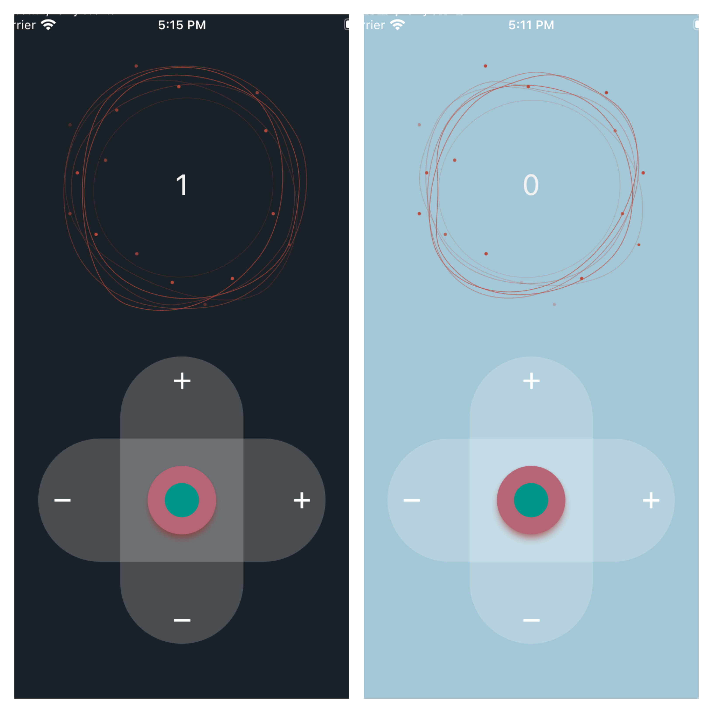

# counter_app

A Flutter project about test and state managment with bloc.

## Getting Started

This project is a starting point for a Flutter application with bloc.

development content:

- theme
- custom widgets
- animations
- bloc state management 
- integration, unit and widget test

